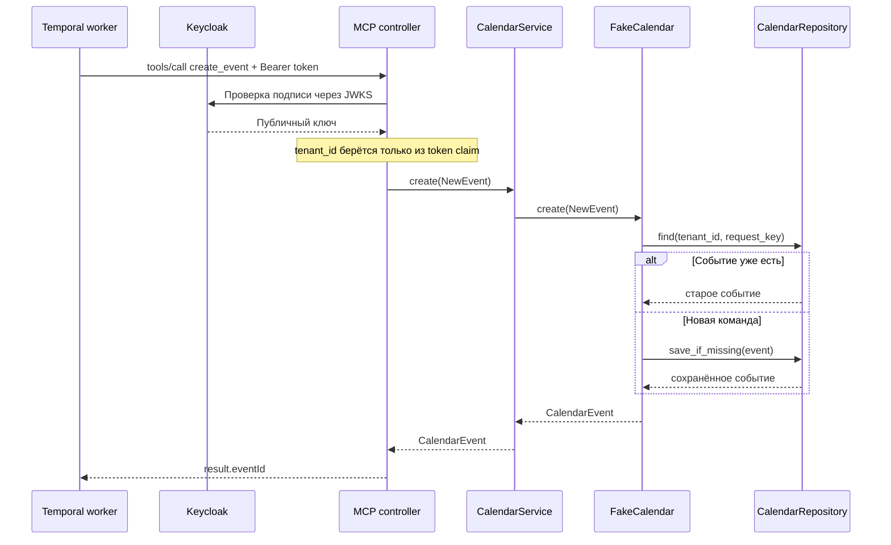

# Архитектура

## Поток команды



## Зависимости папок

```text
controller -> service -> provider -> repository
     |           |          |            |
     v           v          v            v
  MCP/HTTP     model     calendar    fake storage
```

`model` не импортирует MCP или FastAPI. `service` не знает о HTTP и конкретном календаре. Provider
реализует поведение календаря. Repository fake-провайдера отвечает за атомарное `save_if_missing`,
поэтому два одинаковых запуска не создают две встречи.

## Почему request_key обязателен

Temporal может повторить activity после сетевой ошибки. Пара `(tenant_id, request_key)` определяет одну
логическую встречу. Повтор с теми же данными возвращает старый `eventId`; повтор с другими данными
возвращает ошибку конфликта.

`tenant_id` отсутствует во входной схеме MCP tool: вызывающий не может выбрать чужого tenant. Контроллер
получает его из проверенного OIDC-токена. Токен обязан иметь audience `calendar-mcp` и scope
`calendar:write`.

`actor_id` передаётся отдельно от бизнес-payload как trusted execution context. Он может отсутствовать
у старого fake-вызова, но Google provider обязан отклонить выполнение без владельца подключения.

Memory repository обеспечивает атомарность только внутри одного процесса. Пока он используется,
разрешены один Uvicorn worker и одна реплика сервиса. Масштабирование начнётся после подключения общего
хранилища или провайдера с idempotency key.

## Test API

`GET /test/events?requestKey=...` нужен только acceptance-тесту. Он выключен по умолчанию и при
включении требует заголовок `X-Test-Key`. MCP endpoint остаётся `/mcp`, health check — `/health`.
